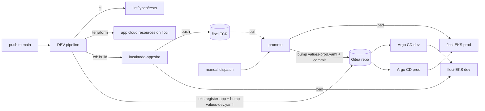

# CI/CD (Gitea Actions)

The lab runs **Gitea Actions** entirely locally. The platform provides the
runner; each app owns its pipelines in its own repo. There is no GitHub, no
cloud — the build, the registry (floci ECR) and the deploy targets (the
**floci-EKS** workload clusters) all live on your machine.

## The runner (platform)

The Gitea Actions runner is provisioned by Terraform (on the second `task install`
apply, once Gitea issues a token) — a host Docker container, pinned in
`lib/common.sh`, torn down on `task prune`.

It is deliberately a **host** container with **host networking** and the host
Docker socket, so a job behaves exactly like a shell on your machine:

- floci is reachable at `http://localhost:4566` (and its ECR registry),
- the MetalLB Gitea IP is routable (Linux host),
- `docker build` uses the host daemon,
- the image loads straight into the floci-EKS k3s node containers,
- **this platform repo is bind-mounted at `/opt/local-gitops`** in every job, so
  the app's pipeline can call platform tasks (notably `task eks:register-app` to
  register its Argo Application with the right cluster's Argo CD).

Jobs run in the `catthehacker/ubuntu` image and target the runner with
`runs-on: lab` (`bootstrap/gitea/runner-config.yaml`). The runner carries no
app name — onboarding an app adds pipelines in *its* repo, never here.

## App pipelines (owned by the app repo)

The `modular-monolithic-app` repo carries these workflows under `.gitea/workflows/`
(its `.github/` workflows are for real AWS/GitHub and are left untouched):

The app's **DEV pipeline is automatic** (on push to `main`) and runs three stages
in order; **PROD is a deliberate manual** promote:

| Stage / workflow | Trigger | Does |
|----------|---------|------|
| **ci** | push / PR to `main` (code paths) | lint, types, dead code, architecture, then the coverage suite (≥97%) against a throwaway PostgreSQL. |
| **terraform** | push to `main` (infra paths) or manual | `terragrunt apply` against floci — provisions **only the app's cloud resources** (ECR, Secrets, SQS/SNS, EventBridge, S3). On floci, **EKS/VPC are gated off**, because the platform owns the cluster. State persisted in floci. |
| **cd** | push to `main` (image-affecting paths) | build prod image → push to floci ECR → load into the platform's floci-EKS **dev** k3s → register the app's Argo `Application` via the platform's `task eks:register-app` → bump `values-dev.yaml`. Argo CD syncs dev. |
| **promote** | manual `workflow_dispatch` (optional `tag`) | take a dev-proven tag → load into floci-EKS **prod** → bump `values-prod.yaml` → commit. Argo CD syncs prod. The prod cluster already exists from `task install`, so only the deploy is manual. |

!!! note "Dependency order: Terraform → build/push → deploy"
    The app's `terraform` stage provisions its cloud resources on floci first,
    because the build pushes to that ECR and the running app reads those Secrets.
    The platform does **not** seed the app's resources — the app owns them. Infra
    (Terraform) runs before the image build (`cd`) before prod (`promote`).

This keeps the GitOps invariant intact: CI never `kubectl apply`s a workload — it
registers the app's Argo `Application` and **commits a tag**, and each cluster's
Argo CD reconciles from Git. The floci ECR is the registry of record; the running
image is loaded into the floci-EKS k3s container.

!!! note "No self-trigger, no double deploy"
    The `cd` stage excludes `values-dev.yaml` from its trigger paths and marks its
    commit `[skip ci]`, so the deploy commit can't loop. Promotion to prod is
    always a deliberate manual dispatch — dev is proven first.

## Prerequisites

- The app must be in Gitea — onboard it from the app repo (`task gitea:create-repo`,
  then `task gitea:ship` to push the code). The default branch in Gitea is `main`.
- The runner needs outbound internet on first use to pull `actions/checkout` and
  the job image.
- The pipelines push back to the repo with the Actions token (`permissions:
  contents: write`). If your Gitea restricts that, seed a PAT as a repo secret
  and swap it in.
