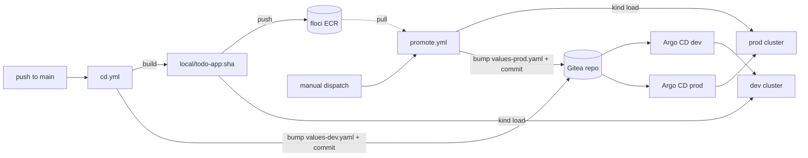

# CI/CD (Gitea Actions)

The lab runs **Gitea Actions** entirely locally. The platform provides the
runner; each app owns its pipelines in its own repo. There is no GitHub, no
cloud — the build, the registry (floci ECR) and the deploy targets (the kind
clusters) all live on your machine.

## The runner (platform)

`install.sh` enables Gitea Actions (`bootstrap/gitea/values.yaml`) and starts a
single host `act_runner` container — same pattern as floci: a host Docker
container, pinned in `lib/common.sh`, torn down by `prune.sh`.

It is deliberately a **host** container with **host networking** and the host
Docker socket, so a job behaves exactly like a shell on your machine:

- floci is reachable at `http://localhost:4566` (and its ECR registry),
- the MetalLB Gitea IP is routable (Linux host),
- `docker build` uses the host daemon,
- `kind load` copies straight into the kind node containers.

Jobs run in the `catthehacker/ubuntu` image and target the runner with
`runs-on: lab` (`bootstrap/gitea/runner-config.yaml`). The runner carries no
app name — onboarding an app adds pipelines in *its* repo, never here.

## App pipelines (owned by the app repo)

The `modular-monolithic-app` repo carries these workflows under `.gitea/workflows/`
(its `.github/` workflows are for real AWS/GitHub and are left untouched):

| Workflow | Trigger | Does |
|----------|---------|------|
| `ci.yml` | push / PR to `main` (code paths) | lint, types, dead code, architecture, then the coverage suite (≥97%) against a throwaway PostgreSQL. |
| `tf-floci.yml` | push to `main` (`infra/terraform/local/**`) or manual | `terraform apply ENV=local` against floci — provisions the **ECR repo + SSM params** the rest depends on. State persisted in floci S3. Manual dispatch can `plan`/`apply`/`destroy`. |
| `cd.yml` | push to `main` (image-affecting paths) | build prod image → push to floci ECR → `kind load` into **dev** → bump `values-dev.yaml` → commit `[skip ci]`. Argo CD syncs dev. |
| `promote.yml` | manual `workflow_dispatch` (optional `tag`) | take a dev-proven tag → `kind load` into **prod** → bump `values-prod.yaml` → commit. Argo CD syncs prod. |

!!! note "One Terraform stack, two triggers — order: Terraform → build/push → promote"
    `install.sh` applies the local Terraform stack at bootstrap, so a clean
    `prune` → `install.sh` comes up with the `gitops/todo-app` ECR repo and the
    `/gitops/<env>/todo-app/*` SSM params already in place. The `tf-floci`
    pipeline runs the **same** stack for ongoing infra changes — they share state
    in floci S3, so neither re-creates what the other made. The dependency order
    still holds: infra (Terraform) before image (`cd.yml`) before prod
    (`promote.yml`), because the build pushes to that ECR and the app's
    `ExternalSecret` reads those SSM params.

This keeps the GitOps invariant intact: CI never `kubectl apply`s a workload —
it only **commits a tag**, and each cluster's Argo CD reconciles from Git. The
floci ECR is the registry of record; the running image is loaded into kind.

!!! note "No self-trigger, no double deploy"
    `cd.yml` excludes `values-dev.yaml` from its trigger paths and marks its
    commit `[skip ci]`, so the deploy commit can't loop. Promotion to prod is
    always a deliberate manual dispatch — dev is proven first.

## Prerequisites

- The app must be in Gitea — onboard it from the app repo (`task gitea:create-repo`,
  then `task gitea:ship` to push the code). The default branch in Gitea is `main`.
- The runner needs outbound internet on first use to pull `actions/checkout` and
  the job image.
- The pipelines push back to the repo with the Actions token (`permissions:
  contents: write`). If your Gitea restricts that, seed a PAT as a repo secret
  and swap it in.
